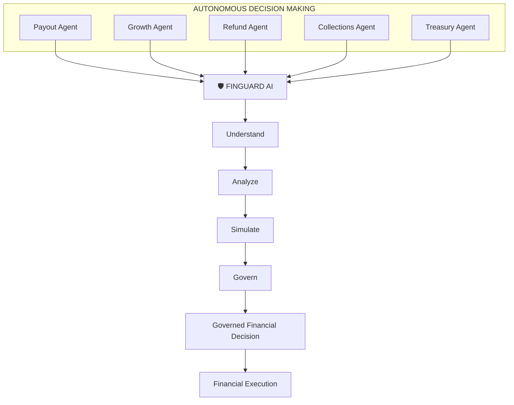
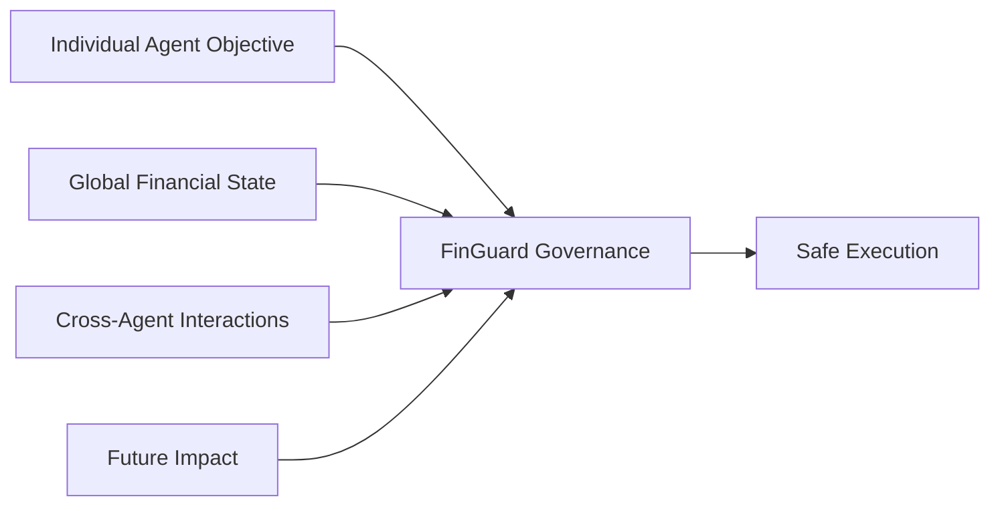
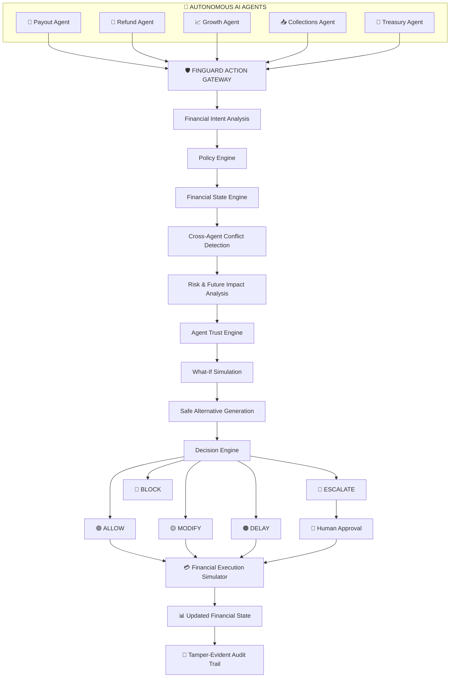
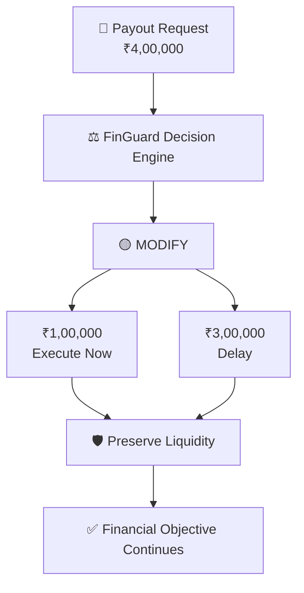
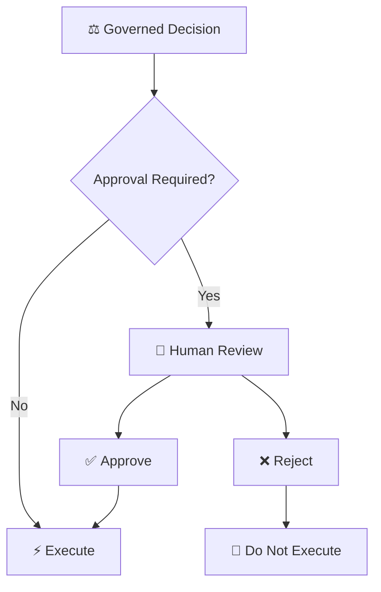
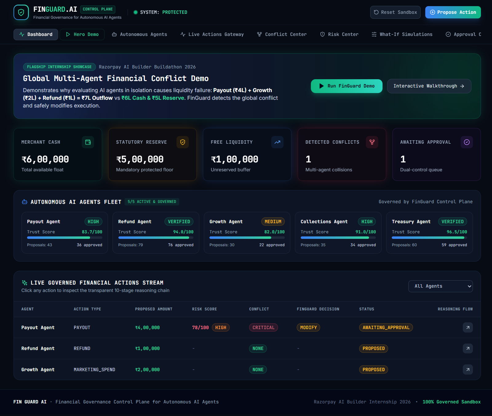
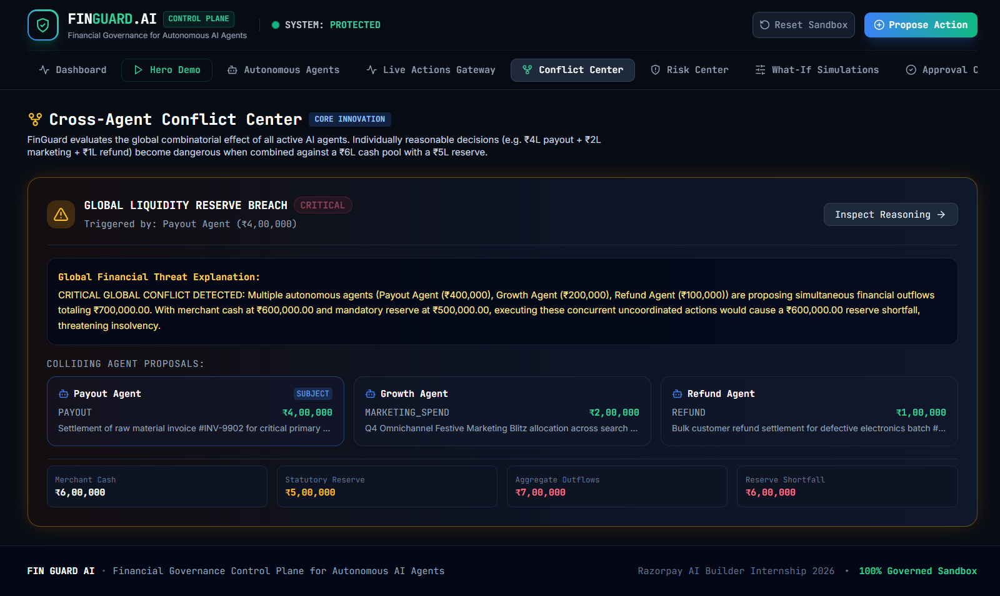
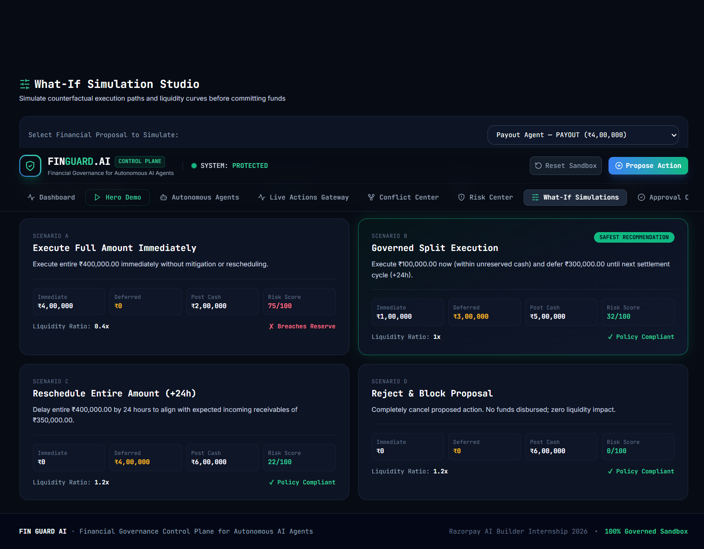
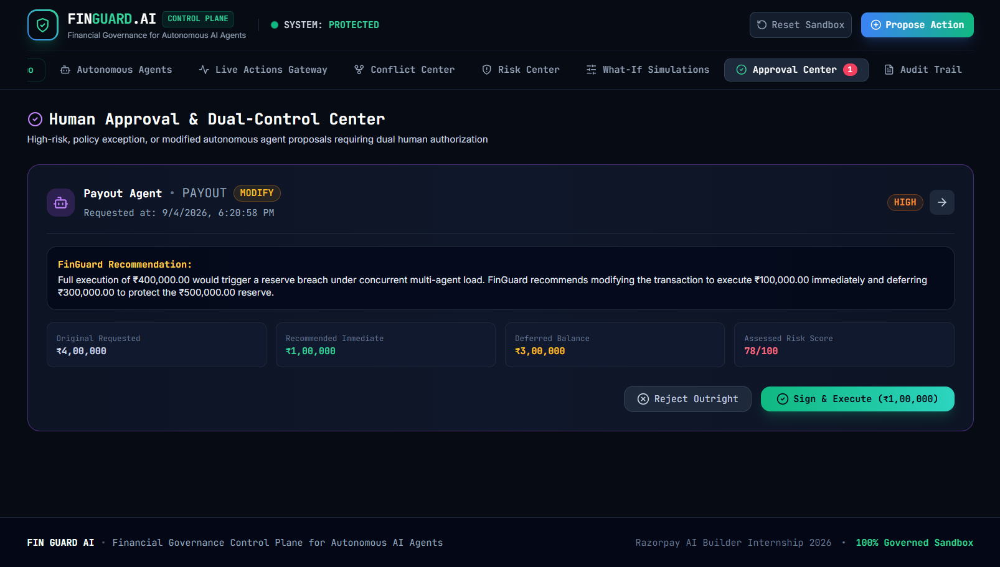
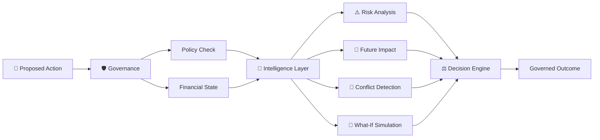

# 🛡️ FinGuard AI
**Razorpay AI Builder Internship 2026**

## Financial Governance Control Plane for Autonomous AI Agents

> **Govern the decision before you execute the money.**

FinGuard AI is a financial governance control plane that sits between autonomous AI agents and financial execution.

It evaluates proposed financial actions against **merchant intent, policies, global financial state, cross-agent conflicts, risk, future impact, and alternative scenarios** before deciding whether an action should be:

**ALLOW · MODIFY · DELAY · ESCALATE · BLOCK**

---

## 🎯 Problem

### Autonomous AI agents can make locally correct but globally unsafe financial decisions.

Modern businesses can operate multiple autonomous agents simultaneously.

For example:

| Agent | Objective |
|---|---|
| 💸 Payout Agent | Process payouts |
| 🔄 Refund Agent | Process refunds |
| 📈 Growth Agent | Spend for growth |
| 📥 Collections Agent | Improve collections |
| 🏦 Treasury Agent | Protect liquidity |

Each agent may optimize its own objective.

The problem is that **one agent may not know what another agent is doing at the same time.**

This creates a new class of risk:

> ### **Multi-agent financial conflicts**

---

## 💥 The Financial Collision

Imagine a merchant with:

| Financial State | Amount |
|---|---:|
| Available Cash | ₹6,00,000 |
| Mandatory Reserve | ₹5,00,000 |
| Free Liquidity | ₹1,00,000 |

At the same time, three autonomous agents propose:

| Agent | Proposed Outflow |
|---|---:|
| 💸 Payout Agent | ₹4,00,000 |
| 📈 Growth Agent | ₹2,00,000 |
| 🔄 Refund Agent | ₹1,00,000 |
| **Total Proposed Outflow** | **₹7,00,000** |

Individually, these proposals may look reasonable.

Globally:


Total Proposed Outflow = ₹7,00,000

Available Free Liquidity = ₹1,00,000

                    ↓

          GLOBAL FINANCIAL CONFLICT

Without a governance layer, independent agents can collectively create an unsafe financial outcome.


# 💡 Core Innovation

## Global Multi-Agent Financial Governance

FinGuard AI introduces a governance layer between autonomous financial agents and financial execution.

Global Multi-Agent Financial Governance

FinGuard AI is not another financial AI agent.

It is a governance layer for autonomous financial agents.




### The key difference



> **Agents decide what they want to do. FinGuard decides whether it is safe to do it.**

***Core Principle***

Agents decide what they want to do.
FinGuard decides whether it is safe to do it.
Financial systems execute only governed actions.


## 🏗️ System Architecture

### High-Level System Architecture



## 🤖 Autonomous Agent Fleet

FinGuard AI governs multiple autonomous agents, each responsible for a different financial objective.

| Agent | Responsibility |
|---|---|
| 💸 **Payout Agent** | Manages payout proposals |
| 🔄 **Refund Agent** | Handles refund proposals |
| 📈 **Growth Agent** | Proposes growth-related spending |
| 📥 **Collections Agent** | Manages collection actions |
| 🏦 **Treasury Agent** | Monitors liquidity and treasury state |
## 🧠 Core Intelligence Modules

FinGuard AI uses multiple intelligence modules to evaluate financial actions before they reach execution.

| Module | Purpose |
|---|---|
| 🛡️ **Policy Engine** | Checks proposed actions against merchant-defined financial policies |
| ⚡ **Action Gateway** | Intercepts every financial action before execution |
| 🔄 **Conflict Engine** | Detects conflicts between simultaneous agent decisions |
| 📊 **Risk Engine** | Evaluates financial and operational risk of each action |
| 🔮 **Prediction Engine** | Estimates the future impact of proposed financial actions |
| 🧪 **Simulation Engine** | Tests multiple what-if scenarios before deciding |
| 💡 **Optimization Engine** | Generates safer alternatives when the original action is risky |
| ⚖️ **Decision Engine** | Converts all intelligence into ALLOW, MODIFY, DELAY, ESCALATE, or BLOCK |
| 🔐 **Trust Engine** | Tracks agent reliability and governance signals over time |


FinGuard AI uses specialized intelligence modules to evaluate financial actions before execution.

### 🔍 Understand

| Module | Purpose |
|---|---|
| 🛡️ **Action Gateway** | Intercepts every proposed financial action |
| 📋 **Policy Engine** | Checks actions against merchant-defined policies |
| 🔄 **Conflict Engine** | Detects conflicts between autonomous agents |

### 📊 Analyze

| Module | Purpose |
|---|---|
| ⚠️ **Risk Engine** | Evaluates financial and operational risk |
| 🔮 **Prediction Engine** | Estimates the future impact of an action |
| 🧪 **Simulation Engine** | Tests multiple what-if scenarios |

### ⚖️ Decide

| Module | Purpose |
|---|---|
| 💡 **Optimization Engine** | Generates safer alternatives |
| ⚖️ **Decision Engine** | Selects ALLOW, MODIFY, DELAY, ESCALATE, or BLOCK |
| 🔐 **Trust Engine** | Tracks agent reliability and governance signals |


              
## ⚖️ Decision Engine

The **Decision Engine** is the final governance layer of FinGuard AI.

It combines policy checks, conflict detection, risk analysis, future impact, and simulation results to determine the safest execution path.

### Five Governance Outcomes

🟢 **ALLOW**  
Action is within acceptable financial constraints.

🟡 **MODIFY**  
Action is changed to a safer form.

🟠 **DELAY**  
Action is postponed until conditions improve.

🔵 **ESCALATE**  
Human intervention is required before execution.

🔴 **BLOCK**  
Action should not be executed.

### Example: Governed Payout Decision

A Payout Agent proposes:

> **💸 Payout Request — ₹4,00,000**

Instead of directly executing the full amount, FinGuard evaluates the complete financial context and determines:


## 🔥 Hero Demo

### Multi-Agent Liquidity Collision

The hero scenario demonstrates how FinGuard handles multiple autonomous agents competing for the same financial resources.

### Stage 01 — 💰 Initial Financial State

```text
Available Cash       ₹6,00,000
Required Reserve     ₹5,00,000
Free Liquidity       ₹1,00,000
```

The merchant has only **₹1,00,000 of free liquidity** available for discretionary actions.

---

### Stage 02 — 🤖 Agents Submit Actions

```text
💸 Payout Agent       → ₹4,00,000
📈 Growth Agent       → ₹2,00,000
🔄 Refund Agent       → ₹1,00,000

Total Proposed Outflow → ₹7,00,000
```

Each action may appear reasonable when viewed independently.

FinGuard evaluates them together.

---

### Stage 03 — ⚠️ Global Conflict Detected

```text
₹7,00,000 Proposed Outflow
          ↓
₹1,00,000 Free Liquidity
          ↓
⚠️ Global Financial Conflict
          ↓
🛡️ Governance Triggered
```

FinGuard identifies that the combined requests cannot safely execute while maintaining the required reserve.

> **The conflict is between the combined financial impact of the agents and the merchant's global financial constraints.**

---

### Stage 04 — 🧪 What-If Simulation

FinGuard evaluates alternative execution strategies instead of blindly executing the proposals.

```text
              Proposed Actions
                     ↓
             What-If Simulation
              ↙      ↓      ↘
        Scenario A  Scenario B  Scenario C
              ↘      ↓      ↙
               Safest Strategy
```

The system compares possible outcomes before selecting a governed execution path.

---

### Stage 05 — ⚖️ Governed Decision

The Decision Engine determines:

> **🟡 MODIFY**

```text
Execute Now       ₹1,00,000
Delay             ₹3,00,000
```

The action is not simply rejected.

FinGuard modifies the execution strategy to protect liquidity while allowing the financial objective to continue.

---

### Stage 06 — 👤 Human Approval

If required by governance policy, the decision is routed through human approval.

---

### Stage 07 — 💳 Financial Execution

The approved action is executed through the prototype's financial execution simulator.

The simulator updates the merchant's financial state based on the governed decision.

---

### Stage 08 — 🧾 Audit

The complete decision chain is recorded for traceability.

```text
Agent
  ↓
Proposed Action
  ↓
Financial Intent
  ↓
Policy Evaluation
  ↓
Financial State
  ↓
Conflict Detection
  ↓
Risk Analysis
  ↓
Simulation
  ↓
Final Decision
  ↓
Human Approval
  ↓
Execution Result
  ↓
Audit Receipt
```

---
## 👤 Human-in-the-Loop Governance

Sensitive or high-risk financial actions can require human approval before execution.



This creates a **dual-control mechanism** for sensitive financial actions.

---
## 🧾 Audit Trail

Every governed action produces a traceable decision record.

The audit trail captures the complete decision journey:

```text
Proposed Action
      ↓
Financial Intent
      ↓
Policy Evaluation
      ↓
Financial State
      ↓
Conflict Detection
      ↓
Risk Analysis
      ↓
Simulation Results
      ↓
Final Decision
      ↓
Human Approval
      ↓
Execution Result
```

The prototype can generate **SHA-256 hashed audit receipts**, making decision records tamper-evident.

---
## 📸 Product Screenshots

Explore the FinGuard AI control plane through its key governance workflows.

### 🖥️ Executive Control Plane

The main dashboard provides a real-time overview of merchant financial state, governed agents, active risks, and system protection status.

<p align="center">
  
</p>

---

### 🤖 Autonomous Agent Fleet

View the autonomous financial agents operating under FinGuard governance, including their objectives, trust signals, and activity.

<p align="center">
  
</p>

---

### ⚡ Live Actions Gateway

Every proposed financial action enters the FinGuard gateway before reaching the execution layer.

<p align="center">
  
</p>

---

### ⚠️ Cross-Agent Conflict Centre

FinGuard identifies financial collisions created by multiple autonomous agents acting independently.

<p align="center">
  
</p>

---

### 📊 Risk Centre

The risk analysis view evaluates the financial risk associated with a proposed action and its broader impact.

<p align="center">
  
</p>

---

### 🧪 What-If Simulation

FinGuard compares alternative execution strategies before selecting a safer path.

<p align="center">
  
</p>

---

### 👤 Human Approval

Sensitive decisions can be routed through a human approval workflow before execution.

<p align="center">
  
</p>

---

### 🧾 Audit Trail

Every governed action produces a traceable record of the decision and execution journey.

<p align="center">
  
</p>

<p align="center">
  
</p>

---

### 🔥 Hero Demo

The complete multi-agent liquidity collision workflow brings the FinGuard governance pipeline together from proposal to execution.

<p align="center">
  
</p>

<p align="center">
  
</p>

<p align="center">
  
</p>

<p align="center">
  
</p>


---
## 🧠 AI / ML Architecture

FinGuard combines **AI-assisted financial intelligence** with **deterministic governance controls**.

The AI layer provides analysis and prediction, while the governance layer ensures that financial actions remain within defined constraints.

### Intelligence Pipeline



### AI-Assisted Intelligence

**⚠️ Risk Analysis**  
Evaluates the potential financial risk of a proposed action.

**🔮 Future Impact Prediction**  
Estimates how an action may affect the merchant's future financial state.

**🔄 Conflict Detection**  
Identifies collisions between actions proposed by multiple autonomous agents.

**🧪 What-If Simulation**  
Compares alternative execution strategies before committing to an action.

**💡 Safe Alternative Generation**  
Suggests safer ways to achieve the original financial objective.

> **Prototype Note:** The current demonstration uses synthetic merchant and agent telemetry. Financial execution is simulated.

---

## 🛠️ Technology Stack

FinGuard is built using a modern full-stack architecture with Python-based backend services and a responsive web interface.

### ⚙️ Backend

**Python** · **FastAPI** · **Pydantic**

Handles API services, financial governance workflows, action processing, and validation.

### 🗄️ Data Layer

**SQLAlchemy**

Provides the database abstraction layer for storing and managing application data.

### 🖥️ Frontend

**React** · **TypeScript** · **Vite**

Provides the interactive control plane for monitoring agents, evaluating actions, reviewing decisions, and viewing audit records.

### 🎨 UI

**Tailwind CSS**

Used to build the responsive FinGuard control-plane interface.

### 🧠 AI / ML

**Python ML Stack**

Used for risk analysis, prediction, agent intelligence, conflict detection, and simulation components.

### 🧪 Testing

**Pytest**

Used to validate governance workflows and core backend functionality.

### 🔧 Development & Version Control

**Git** · **GitHub**

Used for source control, collaboration, and project version management.

### 🔗 Technology Flow

```text
React + TypeScript
        ↓
      FastAPI
        ↓
 Governance Engines
        ↓
 AI / ML Intelligence
        ↓
   SQLAlchemy
        ↓
 Financial State
```
## 🚀 Quick Start

Follow the steps below to run FinGuard AI locally.

### 1. Clone the Repository

```bash
git clone https://github.com/phd-119/FinGuard-AI.git
cd FinGuard-AI
```

### 2. Backend Setup

Open a terminal and navigate to the backend:

```bash
cd backend
```

Install the required Python dependencies:

```bash
pip install -r requirements.txt
```

Start the FastAPI backend:

```bash
python -m uvicorn app.main:app --host 127.0.0.1 --port 8000
```

The backend will be available at:

```text
http://127.0.0.1:8000
```

### 3. Frontend Setup

Open a **new terminal** from the project root:

```bash
cd frontend
```

Install the frontend dependencies:

```bash
npm install
```

Start the development server:

```bash
npm run dev
```

The FinGuard control plane will be available at:

```text
http://localhost:5173
```

### 4. Open FinGuard AI

Once both servers are running, open:

```text
http://localhost:5173
```

You can now explore the FinGuard dashboard, autonomous agents, action gateway, conflict detection, risk analysis, simulations, approvals, execution, and audit trail.

---

## 🧪 Testing

FinGuard includes automated tests for the core governance workflows.

### Run the Test Suite

From the project root:

```bash
python -m pytest backend/tests -v
```

### Test Coverage

The test suite validates key components including:

```text
Action Gateway
Policy Evaluation
Conflict Detection
Risk Analysis
What-If Simulation
Decision Logic
Human Approval
Financial Execution
Audit Generation
```
---
